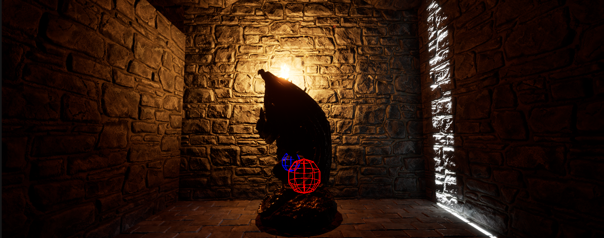
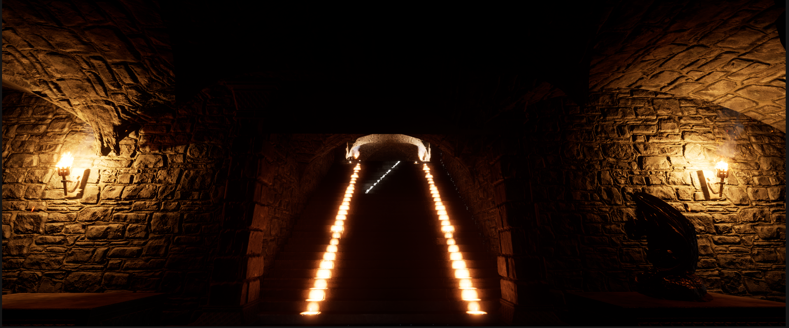
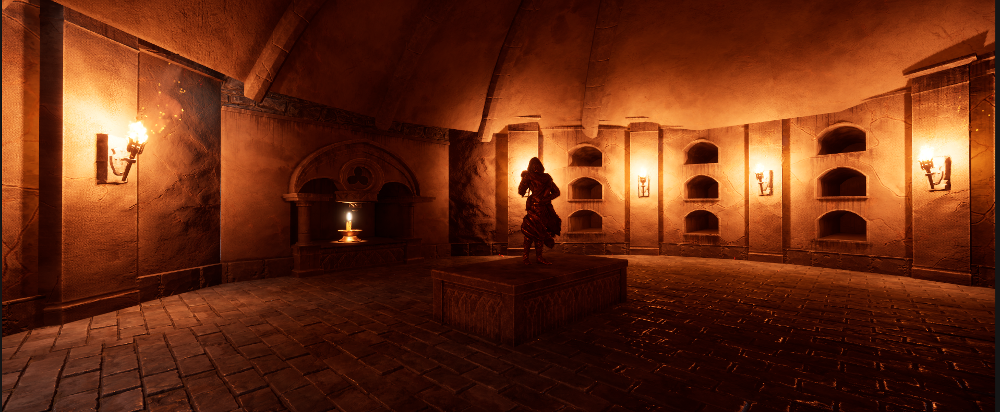
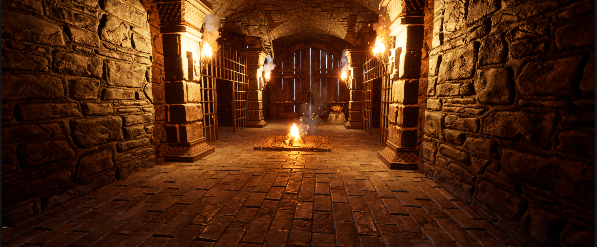

# Crypt Raider

> Crypt Raider is a first-person Unreal Engine 5 gameplay demo focused on exploration, object interaction, and environmental puzzle mechanics.

The goal of this project was to design a highly responsive object interactive system that enabled the player to engage with environmental puzzle mechanics using C++, Blueprints, components, and Unreal Engines's dynamic lighting system. 

[]()
[]()
[]()

## Overview

This project was built in Unreal Engine 5 using C++ and Blueprint systems. The goal was to create a small playable dungeon-style experience featuring interactive objects, collision-triggered events, and modular gameplay logic.

## Features

- Developed gameplay systems in C++ using Unreal Engine 5
- Implemented interactive object handling for player-driven puzzle solving
- Created collision-triggered environmental events
- Built modular gameplay logic for reusable interaction systems
- Used Unreal Engine components and actors to organize gameplay behavior
- Iteratively tested and debugged gameplay flow, object behavior, and level interactions

### Controls

#### Ground Controls

| Action | Keyboard |
|---|---|
| Move | WASD |
| Camera | Mouse |
| Pick up Item | Mouse Left Click |

## 🎥 Gameplay / Demo

Watch the gameplay demo here: [Mini Gameplay Demo](youtu.be/-aq6ZBmH-2k)

---

## 📸 Screenshots

### Dungeon Object and Line Trace



### New Path Unlocked 



### New Area For Exploration


### End Area



## Tech Stack

- Unreal Engine 5
- C++
- Blueprint
- Git / GitHub
- Git LFS

## 🚀 What I Learned

- While developing Crypt Raider, I learned how to implement dependency injection through the utilization of the UMover component. Unreal Engine's UMover component encouraged me to explore the integration of object states that are depenedent on the player's choices. Giving me a better understanding of how to design the player's actions for gameplay sequences. 
- I also learned how to utilize line tracing and sweeping to create interactions between GameObjects and the player. 

---

## 🔮 Future Improvements

- One improvement I'd like to make for this project is to polish and revise a graphical bug that effects the overall immersion and experience for the player. At the moment, there is light from the outside of the crypt that bleeds into the inside. This creates problems with the illusion of immersion because the player is meant to be traversing a dark crypt with only torch lights to guide them. However, the light from the outside breaks that player immersion because they player is now aware that there is a way to the outside world. Rather than wondering if they can even escape.
- Another improvement I'd like to address is fixing a gameplay bug regarding the endgame door. When the player places the final object on the pedestal, the door doesn't open. This is a likely issue due to a bug within the code or a missed implementation that is worth revisting.
- Lastly, I'd like to better optimize my current project by reworking the trigger detection from per-frame overlap polling to event-driven collision to reduce unnecessary runtime queries and CPU overhead.

## Project Structure

```txt
Config/     Unreal project configuration files
Content/    Game assets, maps, Blueprints, and Unreal content
Source/     C++ source code
```

## Notes

This repository uses Git LFS for Unreal Engine asset files such as .uasset and .umap.

To open the project, clone the repository and open the .uproject file in Unreal Engine 5.

## 📝 Documentation

This README was authored and is maintained by Ishmael Kwayisi to
document the project's development, technical implementation, and
solo contributions.

## 🎨 Credits & Attribution

- **Infuse Studio** — MalberS Animations via Fab
  - Used for dungeon structure and prop models.
  - Licensed under the **UE Marketplace License**.